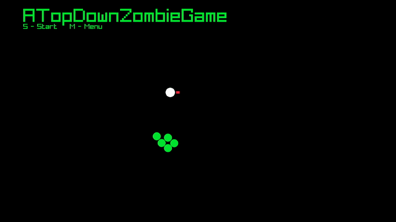
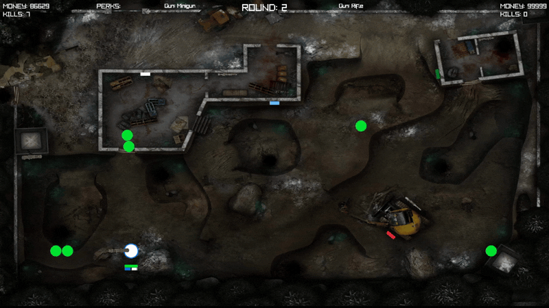
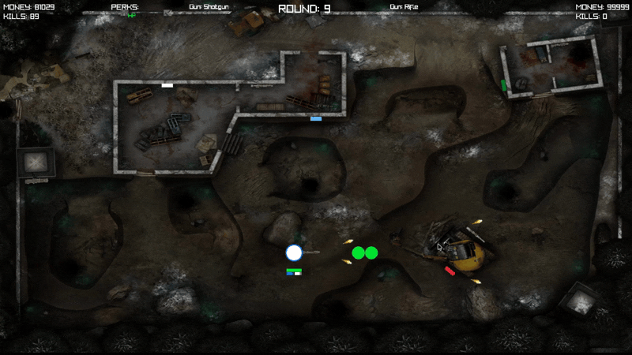

# top-down-zombie-raylib

# About
A 2D top-down zombie survival game with local multiplayer support, featuring multiple weapons, perks, and quest systems.

> **Note:** First Collaborative game project created in 2023, representing an early look at my C++ and game development experience.

# Built With
- C++ (Object-Oriented Programming)
- Raylib (Game Development Library)
- Visual Studio Code

# My Contributions
## Player
- Player Class
- Player Movement
- Player Sprint
- Player Stamina
- Player Rotation with WASD
- 2 Player Mode
- Player-Player Collisions
- Player-Map Barrier Collisions
- Player Health
- Outlined Circles representing each player

## Guns
- Gun Class
- 5 Different guns using different bullet mechanics
- Bullet System
- Reloading
- Gun Recoil
- Gun Weight
- Guns Scattered around map with prices
- Gun Upgrade option activated after n amount of kills
- Bullet aoe effect from gun upgrade

## Perks
- 4 Perks scattered around the map
- Gives perk-specific buffs

## Points
- Points Gained from Shooting Zombies
- Points used for buying Guns and Perks

## Quests
- 2 Different Quests
- Reward and Buff gained from completing quests

## UI
- Displaying Points
- Displaying Kills
- Displaying Equipped Gun
- Displaying Perks
- Displaying Quest Completions

## Visuals
- Health and Stamina Bars
- Reload Bar
- Pixelated Map Background
- Gun Sprites for each gun
- Animated Bullet Sprites

# Contributors
- **Mayar Al Jawhary** - All above Contributions
- **** - Zombies, Different Zombie types + Boss Zombie, Map Walls, Wave System, Animated Menu Screen

# How to Setup
- Clone Repository
- Run the executable: `main.exe`
> **Note:** Infinite points given for this version

# Demos

# Learning Experiences
- Collaborating with Git and GitHub in a team environment
- Managing game development between 2 people without merge conflicts
- Gained deeper knowledge of C++ and early object-oriented programming experience
- Learned C++ vector containers for managing bullets
- Learned sprite management and animation integration
